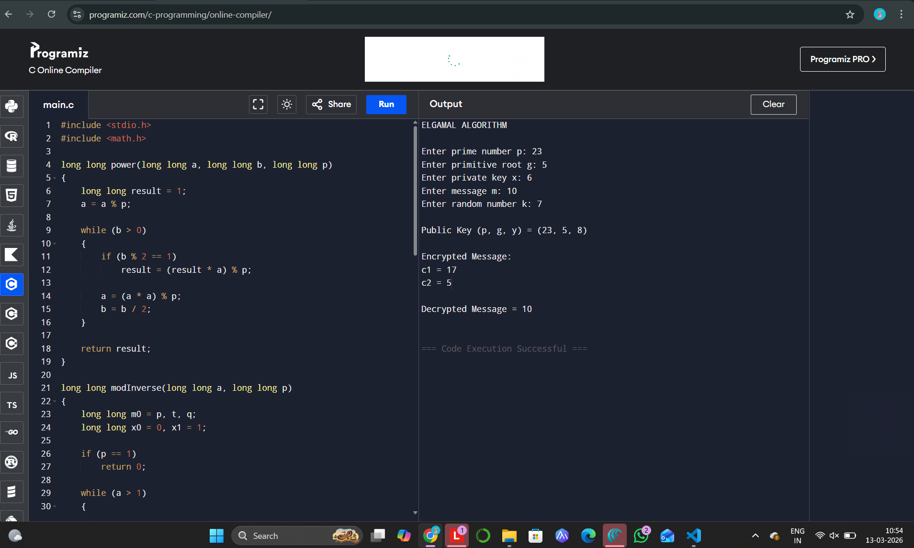

# EX-NO-12-ELGAMAL-ALGORITHM

## AIM:
To Implement ELGAMAL ALGORITHM

## ALGORITHM:

1. ElGamal Algorithm is a public-key cryptosystem based on the Diffie-Hellman key exchange and relies on the difficulty of solving the discrete logarithm problem.

2. Initialization:
   - Select a large prime \( p \) and a primitive root \( g \) modulo \( p \) (these are public values).
   - The receiver chooses a private key \( x \) (a random integer), and computes the corresponding public key \( y = g^x \mod p \).

3. Key Generation:
   - The public key is \( (p, g, y) \), and the private key is \( x \).

4. Encryption:
   - The sender picks a random integer \( k \), computes \( c_1 = g^k \mod p \), and \( c_2 = m \times y^k \mod p \), where \( m \) is the message.
   - The ciphertext is the pair \( (c_1, c_2) \).

5. Decryption:
   - The receiver computes \( s = c_1^x \mod p \), and then calculates the plaintext message \( m = c_2 \times s^{-1} \mod p \), where \( s^{-1} \) is the modular inverse of \( s \).

6. Security: The security of the ElGamal algorithm relies on the difficulty of solving the discrete logarithm problem in a large prime field, making it secure for encryption.

## Program:
```
#include <stdio.h>
#include <math.h>

long long power(long long a, long long b, long long p)
{
    long long result = 1;
    a = a % p;

    while (b > 0)
    {
        if (b % 2 == 1)
            result = (result * a) % p;

        a = (a * a) % p;
        b = b / 2;
    }

    return result;
}

long long modInverse(long long a, long long p)
{
    long long m0 = p, t, q;
    long long x0 = 0, x1 = 1;

    if (p == 1)
        return 0;

    while (a > 1)
    {
        q = a / p;
        t = p;

        p = a % p;
        a = t;
        t = x0;

        x0 = x1 - q * x0;
        x1 = t;
    }

    if (x1 < 0)
        x1 += m0;

    return x1;
}

int main()
{
    long long p, g, x, y, k, m;
    long long c1, c2, s, s_inv, decrypted;

    printf("ELGAMAL ALGORITHM\n");

    printf("\nEnter prime number p: ");
    scanf("%lld", &p);

    printf("Enter primitive root g: ");
    scanf("%lld", &g);

    printf("Enter private key x: ");
    scanf("%lld", &x);

    printf("Enter message m: ");
    scanf("%lld", &m);

    printf("Enter random number k: ");
    scanf("%lld", &k);

    y = power(g, x, p);

    printf("\nPublic Key (p, g, y) = (%lld, %lld, %lld)", p, g, y);

    c1 = power(g, k, p);
    c2 = (m * power(y, k, p)) % p;

    printf("\n\nEncrypted Message:");
    printf("\nc1 = %lld", c1);
    printf("\nc2 = %lld", c2);

    s = power(c1, x, p);
    s_inv = modInverse(s, p);

    decrypted = (c2 * s_inv) % p;

    printf("\n\nDecrypted Message = %lld\n", decrypted);

    return 0;
}
```

## Output:


## Result:
The program is executed successfully.
